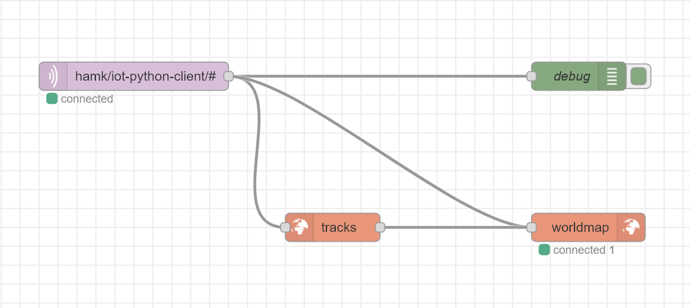

# HAMK, IoT Ark Excercise MQTT Client with Python for Node RED + Maps

This is a simple MQTT client publishing some bogus values to simulate for the excercise for IoT Ark course on [HAMK](https://www.hamk.fi/korkeakouludiplomi/iot-data-ja-pelimoottoriosaaja/) in 2022.

You can see how the Arctic Circle is operating as it will publish coordinates of several entities. 😀

During publish, sensor name is appended to the MQTT topic, which allows you to subscribe to single sensor updates (or multiple with for example "`#`").

Latest implementation connects each sensor as separate MQTT client (incl. own client id).

Made by: Visa Hannula

## Topic format
Topic format is `MQTT_TOPIC/<sensor name>`

In the topic, space characters in name are replaced with underscore. So for example sensor name "Santa Claus" will become: `hamk/iot-python-client/Santa_Claus`.

## Defining sensors
It provides a sensor class which defines name and location coordinates of the sensor. Sensor can be given speed values for how fast it will move on the coordinate system.

Uses Paho MQTT (you might need to import, see requirements.txt).


## To Run with environment variable (Linux)

Broker is "localhost" as default but you can define environment var `MQTT_BROKER` as broker hostname or IP-address.

```sh
export MQTT_BROKER=192.168.0.2; python hamk-iot_maps.py
```

# Node-RED flow

See the attached flow file [HAMK.IoTArk.3.Maps.json](HAMK.IoTArk.3.Maps.json) (it is very simple but uses [node-red-contrib-web-worldmap](https://github.com/dceejay/RedMap))


